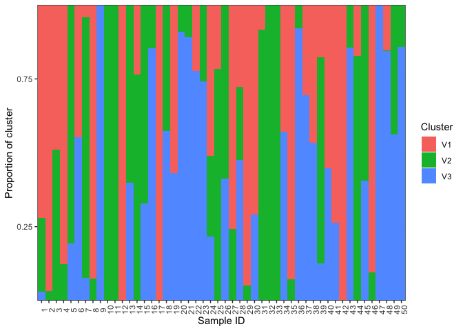
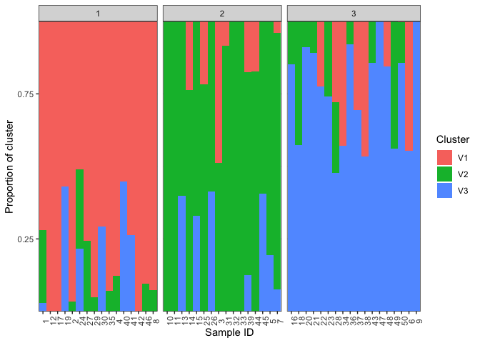

EVE 109 Section Week 4
================

### 1. The `aggregate` and `apply` functions

Today we'll two useful functions that you can use for dataframes, `apply` and `aggregate`. Let's use the `iris` dataset again:

``` r
data(iris)
head(iris)
```

    ##   Sepal.Length Sepal.Width Petal.Length Petal.Width Species
    ## 1          5.1         3.5          1.4         0.2  setosa
    ## 2          4.9         3.0          1.4         0.2  setosa
    ## 3          4.7         3.2          1.3         0.2  setosa
    ## 4          4.6         3.1          1.5         0.2  setosa
    ## 5          5.0         3.6          1.4         0.2  setosa
    ## 6          5.4         3.9          1.7         0.4  setosa

 

One thing we might want to do is find out which individual has the highest value for each column. We can use the `apply` function to do the same thing to each column:

``` r
?apply
apply(iris[,1:4],MARGIN=2,which.max)
```

    ## Sepal.Length  Sepal.Width Petal.Length  Petal.Width 
    ##          132           16          119          101

Notice that we only used columns 1-4 because the last column is categorical. The second argument, *MARGIN*, is asking whether we should be doing the function for each row (MARGIN=1), or each column (MARGIN=2). The final argument is the function we want to use. `which.max` asks for the index (in this case, which row) has the maximum value.  

Another useful function is `aggregate`. Sometimes you might want to summarize groups within a dataframe. `aggregate` does this easily. For example, what if we want to average values for each species:

``` r
?aggregate
aggregate(iris[,1:4],by=list(iris$Species),mean)
```

    ##      Group.1 Sepal.Length Sepal.Width Petal.Length Petal.Width
    ## 1     setosa        5.006       3.428        1.462       0.246
    ## 2 versicolor        5.936       2.770        4.260       1.326
    ## 3  virginica        6.588       2.974        5.552       2.026

This gives us the mean for each set of rows that share a value in the "Species" column. The second argument, *by*, tells how to group. The third argument is the function to use.

 

These commands will come in handy today!

     

### 2. Running a clustering analysis and deciding on a K value

A common way to analyze population structure is using hierarchical clustering. Probably the most heavily used program to do this is called STRUCTURE. However, we'll stick to similar tools you can use in R. Today we'll install two different packages, `LEA` and `starmie`. LEA will be used to analyze the data and starmie will be used for visualization. LEA cannot be downloaded from the normal R database, so use the following code:

``` r
source("http://bioconductor.org/biocLite.R")
biocLite("LEA")
```

And install starmie in the normal way:

``` r
install.packages("starmie")
```

Then load both libraries:

``` r
library(LEA)
library(starmie)
```

 

For the analysis today, we're going to use SNP data. Open the file in the data folder called **example.geno** using a text editor. This file is in *geno* format. That means there is one line per individual and genotypes are coded as 0,1,or 2. 0 and 2 are homozygotes and 1 is a heterozygote. 9 means missing data. Notice that this only works when you are looking at SNPs with just 2 alleles (biallelic).

 

We'll use the package LEA to read this file in and look at population structure:

``` r
project <- snmf("data/example.geno",
               K = 1:10, 
               entropy = TRUE, 
               repetitions = 10,
               alpha=100,
               project = "new")
```

 

Remember what K values are? That means how many populations should we try to split this data in to. Here we run 10 *repetitions* per K value. That's because each run is slightly different so you want to have confidence in your answer. You'll see what entropy means in a second. You'll get a bunch of output in your console when you run this command. It will also create a new folder on your computer called "example.snmf". It contains a bunch of different files for each run of the clustering program. We will be able to use these files to analyze and visualize our results.

 

Now we'll chose the "best" value of K. Know that there are several ways to do this and they don't always agree, so this should be interpreted with caution. Here we will use cross-entropy loss. This basically asks how consistently our model is able to categorize the samples. The lower the cross-entropy the better the model is doing. Let's plot all the values of K:

``` r
plot(project,col="blue",pch=19)
```


 

When I ran this, **K=4** had the lowest cross entropy. This plot might look slightly different each time you run it.

     

### 3. The Q matrix

Now that we've decided which value of K to look at, we can look at the ancestry estimates for each individual.

``` r
qmatrix <- Q(project,K=3,run=1)
```

 

This command pulls out the ancestry matrix (called the *Q matrix*) for the first run with K=3. Let's look at the Q matrix.

``` r
head(qmatrix)
```

    ##               V1          V2          V3
    ## [1,] 0.720829000 0.250110000 0.029060900
    ## [2,] 0.966564000 0.033336100 0.000099991
    ## [3,] 0.488427000 0.511473000 0.000099991
    ## [4,] 0.877583000 0.120222000 0.002194510
    ## [5,] 0.000099991 0.806777000 0.193123000
    ## [6,] 0.447247000 0.000099991 0.552653000

 

Here, each row is an individual and each column is one of the inferred clusters. First, lets give the individuals "IDs" as rownames. You'll see that this is important later. Next, one thing we could do is look at which cluster has the highest ancestry for each individual. The `which.max` function just gives you the index (which column in this case) of the highest value.

``` r
rownames(qmatrix) <- 1:nrow(qmatrix)
maxCluster <- apply(qmatrix,1,which.max)
maxCluster
```

    ##  1  2  3  4  5  6  7  8  9 10 11 12 13 14 15 16 17 18 19 20 21 22 23 24 25 
    ##  1  1  2  1  2  3  2  1  3  2  2  1  2  2  2  3  1  3  1  3  3  3  3  1  2 
    ## 26 27 28 29 30 31 32 33 34 35 36 37 38 39 40 41 42 43 44 45 46 47 48 49 50 
    ##  2  1  3  1  1  2  2  2  3  1  3  3  3  2  1  1  1  3  2  2  1  3  3  3  3

 

If we pretend `maxCluster` gives refers to the population from which the individual came, we can use the `aggregate` function to look at average cluster membership across each population:

``` r
aggregate(qmatrix,by=list(maxCluster),mean)
```

    ##   Group.1         V1         V2        V3
    ## 1       1 0.81928744 0.07558183 0.1051307
    ## 2       2 0.08850443 0.79022150 0.1212741
    ## 3       3 0.12811117 0.11555745 0.7563314

     

### 4. Plotting

Now lets plot the ancestry results. Basically, we just want to make a barplot of the qmatrix. The `plotBar` function from the starmie package does this nicely:

``` r
plotBar(qmatrix,facet=FALSE)
```



We can also ask it to group based on population. Look at the `plotBar` documentation. To group by population we need a two column dataframe where the first column is the sample number and the second column is the population. We'll use the sample IDs we made up earlier and the maxCluster as the population. With other data you might use some other factor as the population, such as subspecies or geographical location.

``` r
pops <- cbind(sampleID=rownames(qmatrix),pop=maxCluster)
plotBar(qmatrix,populations=pops,facet=FALSE)
```



     

Homework
========

For homework, we will use population structure analysis to look at ancestry in Chirikof Island cattle. The data folder contains two relevant files:  

**cattle.geno** is the genotypes file for a subset of the populations used in the paper  

**metadata.csv** is a file with the population and species info for all the individuals included in the genotypes file. Note that they are in the same order as in the genotypes file.

### *Homework 4: Write a script that does the following:*

#### 1. Read in the metadata file. Print a table showing how many individuals we have from each population.

#### 2. Run the clustering analysis using the `snmf` command. Create a cross-entropy plot.

#### 3. Get a Q matrix for the "best" K value. Add sample IDs from the metadata file as rownmaes to the Q matrix. Print the head of the Q matrix.

#### 4. For the Chirikof Island population, what are the average ancestry proportions from each cluster?

#### 5. Plot the ancestry barplot, grouped by population.
